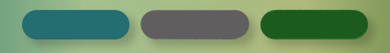

# Vegan life 

The Vegan Life website is a space intended to make simple and accecible the basic principles and information about veganism.
For people that are curious about it and not intirely sure of what it is about, it addresses the first more commun questions and obstacles around the topic.

Users of this website will have answered the questions of:

- Why one would become vegan,
- How one would embrace the lifestyle,
- What one would eat as vegan,

## Table of Contents

- [Features](#features)
- [Testing](#testing)
- [Deployment](#deployment)
- [Credits](#credits)

 

## Features
 
- ### Navigation:

    - Featured at the top of the page, it shows the website name/Logo in the top left corner (Vegan Life) which links to the top of the home page (index.html).
    - It appears in all the available pages of the website with the same positioning, configuration and functions, enabeling the user to never 'get lost'.
    - It has five more navigation links are placed on the top right: Home, About, Get Informed, Recipes and Subscribe. Those are linked to other sections of the Home page and to tow other pages ('Get Informed' links to get.informed.html and Recipes links to recipes.html).
    - It clearly shows the user the name/subject of the page as well as what are and where to find the different sections available for navigation.
    - All its elements are of a dark grey color against white background, providing good contrast.
    
     

- ### Header:

    - It shows an hero-image that sugests a globalistic aproach to the theme of the website (veganism) as oposed to the more commonly associated imagery (of food or animal wellfare) with a semi-transparent sentense on top of it ('Eating tofu is just for some... being educated is for everyone') intended to challenge and incentivise the user to want to learn more.
    - Its image sets the color scheme (shown below) for all the website pages.
    - It helps the user to further understand what the site is about and who is it for (refering the targeted audience as all people interested in understanding more about the topic of veganism).

    

- ### Home:
    - The first in the sequence of links (nav bar) placed on the top righ of all pages.
    - It links to the top of the home page (index.html).
    

- ### About:
    - The second in the sequence of links (nav bar) placed on the top righ of all pages.
    - It links to a section of the home page where the user can see the title of the secction, an image illustrating the initial confusion about the topic and a box with a scrool side bar containing the writen info about the topic.
    
    

- ### Get informed:
    - The third in the sequence of links (nav bar) placed on the top righ of all pages.
    - It links to a section of the home page where the user can see the title of the secction and find three divisions, each one reffering to a common question the user might have.
    - Its divisions are catered to organize the information and make it easier to follow.
    - Each division is composed of:
        - Question title,
        - Illustrative image (linked to the page 'information.html' and corresponding section)
        - Answer to the corresponding question in bullet points 
        - A 'read more' link (to the page 'information.html'and corresponding section)
    
    - The user can see these questions ('Why', 'How', 'What') answered in more detail on the corresponding section of the page 'information.html'
    
     

    ### Information Page
    
    Why
    - The user is redirected to the information page through the link on the home page ('Get informed' section), where the question 'Why' is answered at the top of the page.
    - For reference, the link-image shown on the home page can be seen here, along with two others that illustrate the three pointed reasons why.

 

    How
     - The user is redirected to the 'How' section of the information page through the link on the home page ('Get informed' section), where the question 'How' is answered on the midle of the page.
    - For reference, the link-image shown on the home page can be seen here along with a sequenced other.

 

    What
    - The user is redirected to the 'What' section of the information page through the link on the home page ('Get informed' section), where the question 'What' is answered at the bottom of the page.
    - An image is shown to illustrate and give context to the provided indormation.
    - The text contains an external link that will open in a new tab.

 

- ### Get inspired:
    - The fourth in the sequence of links (nav bar) placed on the top righ of all pages.
    - Takes the user to the section where he can click on images to navigate to an inspirational gallery page.

    
    
    - The gallery is divided in the following sections:

    Breakfast
 
    Lunch & dinner
     
    Desserts & snacks
    

- ### Subscribe:
    - The fifth in the sequence of links (nav bar) placed on the top righ of all pages.
    - Contains an illustrative image on the left and a form on the right.
    - The form requires the input of a name and an email for submition.
    - Once submited, the user is redirected to a Thank you page.

 

- ### Thank you page:
    - From the thank you page, the user can continue the navigation in the website or throught the social media links on new tabs.

 ## Testing

- The page was tested in different browsers: Chrome, Firefox, Safari.
- I confirmed the project is responsive by using the devtools device toolbar. It looks and works properly across standard screen sizes from 1600px wide desktops to 768px wide tablets.
- I confimed that all the writen content of each section is easily readable and understandable.
- I confirmed that the form works properly (requires entries in every field, requires an email entry in the asigned field and the submit button also works).

 ### Bugs:
Solved
- All the CSS styling was and links were compromised when trying to run the site on regular browsers.
- The problem was the need to use relative paths.

Unsolved
- The media queries for small screen sizes did not work as expected.

 ### Validator Testing

- HTML
    
- CSS
    
 
   

## Deployment

 The website was deployed to GitHup pages.
- The steps to deploy it were as folows:
    - In the GitHub repository I navigated to the 'Settings' tab
    - On the left collum menu, in the 'Code and automation' section, clicked on the link: 'Pages'
    - On the 'Build and deployment' area of the page, the 'Source' section drop-down menu must have active the option: 'Deploy from a branch'
    - Below that, on the 'Branch' section, on the first drop-down menu I selected the option: 'main'. The second drop-down menu must have active the option: '/(root)'

    The live link can be found here: <a href="https://raffa-g.github.io/project1/">Vegan Life</a> 

## Credits

 ### Content
 Various bits of code were for taken from:
 - The Love Running project, maningly:
    - Cover text
    - Social media links
 - The <a href="https://w3schools.com/">W3 Schools</a> website, maningly:
    - Smooth scroll for the html
    - Scroll bar for the 'About' section
- The <a href="https://mycolor.space/">Color Space</a> website, namingly:
    - Color gradiance for background image in the'Subscribe' section.
Sections of writen content taken from:
- https://www.vegansociety.com/

### Media
- Hero image in the header titled 'hero-image': Photo by Oliver Sjöström from Pexels: https://www.pexels.com/photo/body-of-water-near-green-mountain-931018/
- Video in the 'About' section: 
- Images in the 'Get informed' section:
    - Titled 'why': Photo by Ron Lach  from Pexels: https://www.pexels.com/photo/people-cleaning-the-beach-9037592/
    - Titled 'how': Photo by Sam Lion from Pexels: https://www.pexels.com/photo/crop-asian-woman-with-banana-flower-near-girlfriend-in-bazaar-5709277/
    - Titled 'what': Photo by fauxels from Pexels: https://www.pexels.com/photo/group-of-people-eating-together-3184195/

- Images in the 'Recipes' section:
    - Titled 'breakfast': Photo by Taryn Elliott from Pexels: https://www.pexels.com/photo/red-and-white-round-fruits-on-brown-wooden-bowl-4099237/
    - Titled 'lunch-dinner':
    - Titled 'desserts': Photo by Lina Kivaka from Pexels: https://www.pexels.com/photo/close-up-photo-of-cakes-near-glass-window-2773606/
    
- Image in the 'Subscribe' section, titled 'e-book': Photo by RF._.studio from Pexels: https://www.pexels.com/photo/high-angle-photo-of-person-reading-an-e-book-3060654/

